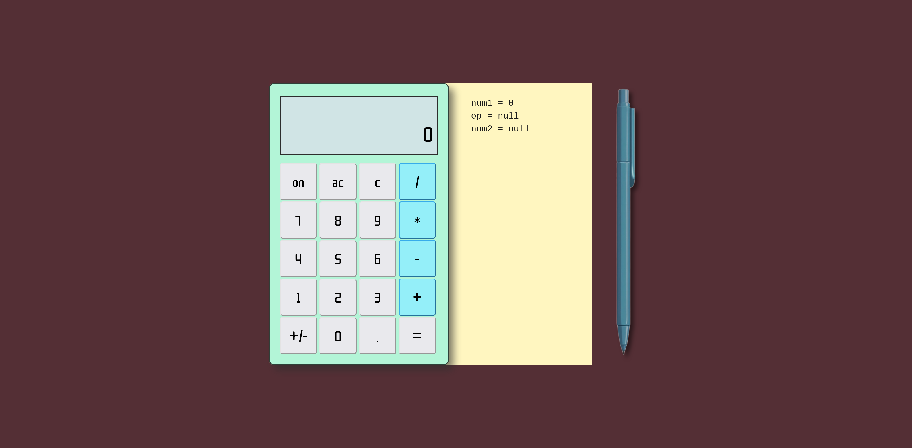

# top-calculator
A calculator project. This is a JavaScript assignment from The Odin Project.

## Reflections
Initially, I thought this project would be a breeze, just do basic operations on two numbers inputted from the user and display the result. However, there are more considerations and nuances than I thought in a simple calculator.

Some challenges I faced in this project includes: how to preventing digits from appending to existing results when user pressed a number, how should long numbers be handled on display, and when should certain buttons like the negate button and backspace button be allowed to affect the numbers on display. 

From this project, I gained more familiarity and experience working with JavaScript, CSS and HTML.